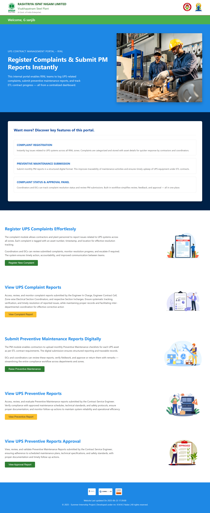

<h1 align="center">UPS Contract Management System</h1>

<h2>📌 Project Overview</h2>

The <b>UPS Contract Management System</b> is a web-based application designed to centralize and digitize
The management of UPS contracts, maintenance activities, and complaint handling.
It replaces manual and fragmented processes with a structured digital solution,
improving system reliability and operational efficiency.

<h2>🛠 Features</h2>
<ul>
  <li>Create, Read, Update, and Delete (CRUD) operations for UPS contracts</li>
  <li>Preventive Maintenance (PM) scheduling and tracking</li>
  <li>Breakdown complaint registration and status monitoring</li>
  <li>Verification and approval workflows</li>
  <li>Centralized and secure data management</li>
</ul>

<h2>⚙️ System Benefits</h2>
<ul>
  <li>Reduces manual effort and paperwork</li>
  <li>Improves monitoring and compliance</li>
  <li>Ensures reliable UPS system operation</li>
  <li>Enhances transparency and accountability</li>
</ul>

<h2>🧰 Technologies Used</h2>
<ul>
  <li><b>Frontend:</b> HTML, CSS, JavaScript</li>
  <li><b>Backend:</b> Node.js (Express)</li>
  <li><b>Database:</b> MySQL</li>
</ul>

<h2>🔧 Backend Setup & Server Execution</h2>
<ol>
  <li>Install Node.js and MySQL on the system.</li>
  <li>Create the required database and tables in MySQL.</li>
  <li>Configure database credentials in a <code>.env</code> file.</li>
  <li>Open the project folder in Visual Studio Code.</li>
  <li>Install backend dependencies.</li>
  <li>Run the backend server from the terminal.</li>
  <li>Verify successful connection between the server and database.</li>
</ol>

<h2>📷 Screenshots</h2>
<table border="1" cellpadding="10" cellspacing="0">
  <tr>
    <th>Module</th>
    <th>Preview</th>
  </tr>
  <tr>
    <td>Dashboard</td>
    <td>
      
    </td>
  </tr>
  <tr>
    <td>Register Complaint</td>
    <td>
      
    </td>
  </tr>

</table>

<h2>📄 License</h2>

This project is licensed under the <b>MIT License</b>.

Permission is hereby granted, free of charge, to any person obtaining a copy of this software and associated
documentation files (the “Software”), to deal in the Software without restriction, including without limitation
the rights to use, copy, modify, merge, publish, distribute, sublicense, and/or sell copies of the Software,
subject to the following conditions:

The above copyright notice and this permission notice shall be included in all copies or substantial portions
of the Software.

THE SOFTWARE IS PROVIDED “AS IS”, WITHOUT WARRANTY OF ANY KIND, EXPRESS OR IMPLIED.

